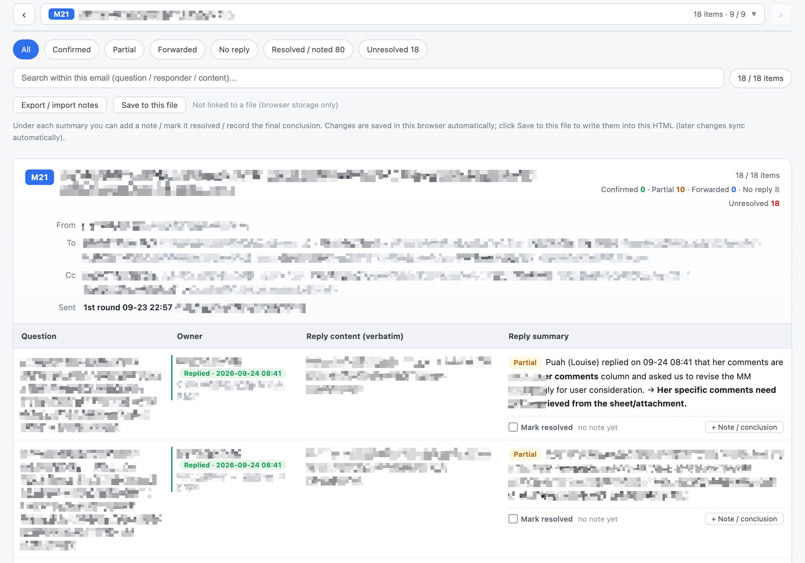

# Coremail 邮件总结

一个用于 Coremail 网页版的邮件反馈追踪 Skill。它会把“我方发出的邮件”和“对方后续回复”配对整理，适合需求澄清、评审请求、范围确认、报价问询和其他需要逐条跟进的场景。

> [!IMPORTANT]
> 要获得最佳效果，**必须使用 Tabbit Browser，并通过 Tabbit CLI 执行浏览器操作**。本 Skill 的标签页接管、邮件读取、会话遍历和安全校验流程都是围绕这套环境设计的；使用其他浏览器无法保证完整功能和稳定性。
>
> [通过我的推广链接使用 Tabbit Browser](https://web.tabbit.ai/activity/invite/F1E33DB4?k=gvACADsb6ta4ADqt2lQmADcQNw)

## 效果示意

下图为脱敏后的英文版反馈汇总页面。它展示了邮件切换、状态筛选、问题搜索、收发件人信息、负责人回复状态、原文与总结对照，以及“已解决 / 备忘结论”等功能。



## 它能做什么

- 同时检查已发送和收件箱，定位我方发出的邮件及后续回复；
- 以“一封我方邮件”为一个分组，合并同主题的首轮与跟进内容；
- 识别正文回复、彩色表格批注、追加列回复、Google Docs 评论通知以及会议或群聊反馈；
- 为每个问题整理负责人、回复原文、反馈总结和当前状态；
- 标记意见不一致、部分回复、转交他人和未回复事项；
- 输出中文 HTML、英文 HTML 和 Markdown 三件套；
- 保留人工填写的“已解决”和“备忘 / 最终结论”，便于下一轮继续更新。

## 安全边界

Skill 默认以读取和整理为主，不会自行删除邮件、清除登录状态、修改账号设置或读取密码。发送邮件、处理附件、关闭页面和修改邮件状态等操作，需要用户明确授权。

移动邮件是唯一内置的写操作，并且默认只做预演，同时检查目标文件夹、相关性和单次处理数量。

## 安装

### 下载整包

从 [Releases](https://github.com/tolyer/coremail-email-summary/releases) 下载 `coremail-email-summary-v1.0.0.zip`，解压后将其中的 `coremail-sent-feedback-tracker` 文件夹复制到个人 Skills 目录：

```text
~/.codex/skills/
```

复制完成后，新建一个 Codex 任务或重启 Codex。

### 从仓库安装

克隆或下载本仓库，再复制 [`coremail-sent-feedback-tracker`](coremail-sent-feedback-tracker/) 文件夹即可。

## 前置条件

- **必须安装并运行 Tabbit Browser，同时使用 Tabbit CLI；**
- 能正常访问并登录目标 Coremail 网页版；
- Python 3.10 或更高版本；
- Node.js 为可选依赖，用于检查生成报告中的 JavaScript 语法。

## 首次使用前

请先检查并调整以下内容：

1. 本人邮箱地址和对方邮箱域名；
2. `scripts/owner_rules.py` 中的负责人映射；
3. 报告标题、输出文件名和本地存储键；
4. 需要统计的邮件范围和时间窗口。

详细配置、运行步骤和故障排查请参阅 Skill 内的 [`README.md`](coremail-sent-feedback-tracker/README.md)。

## 使用示例

- “检查我最近发出的需求澄清邮件，把客户回复逐条整理出来。”
- “更新上次的邮件反馈清单，保留我已经标记的解决状态和备忘。”
- “生成中文、英文和 Markdown 三个版本，并列出仍未解决的问题。”

## 版本

`coremail 邮件总结 v1.0.0`  
发布日期：2026-10-04
